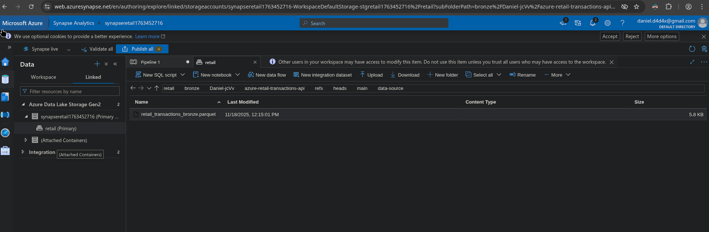
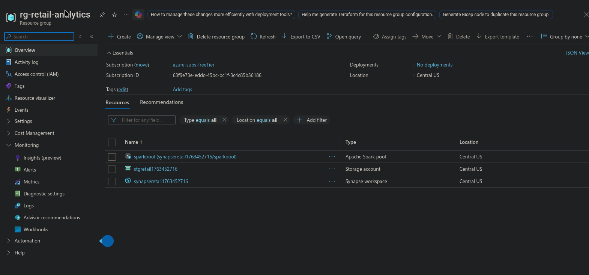
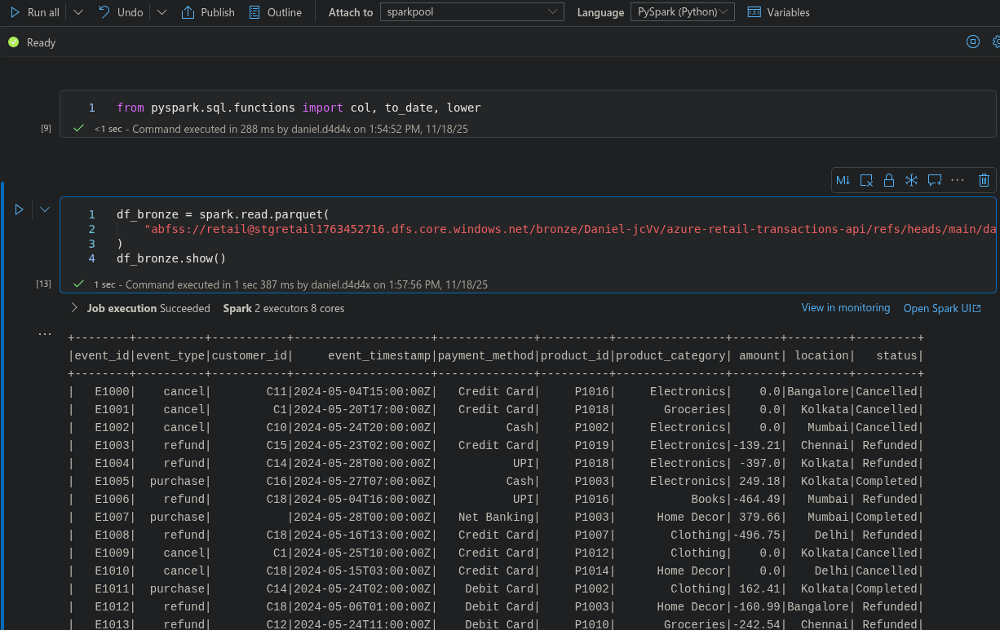
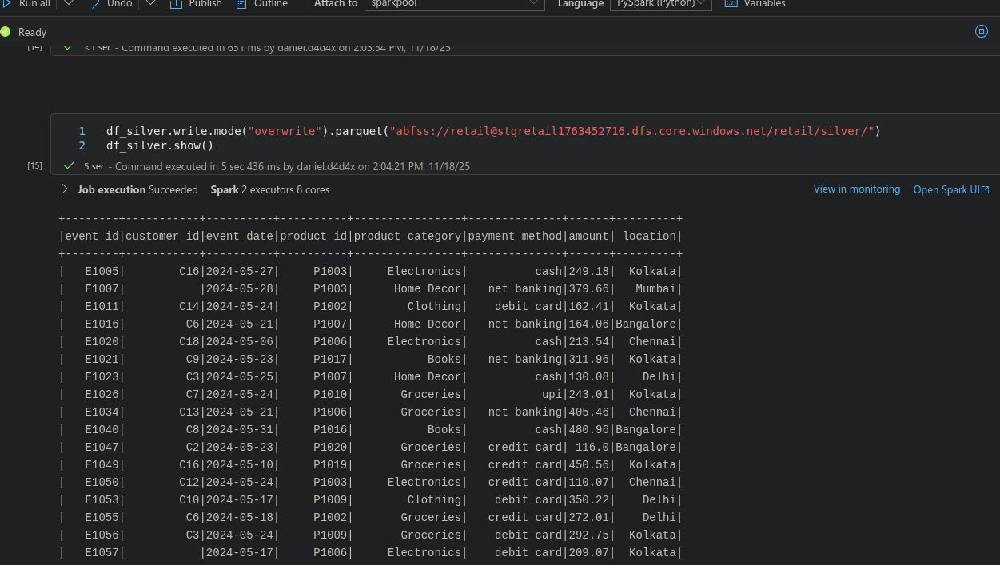
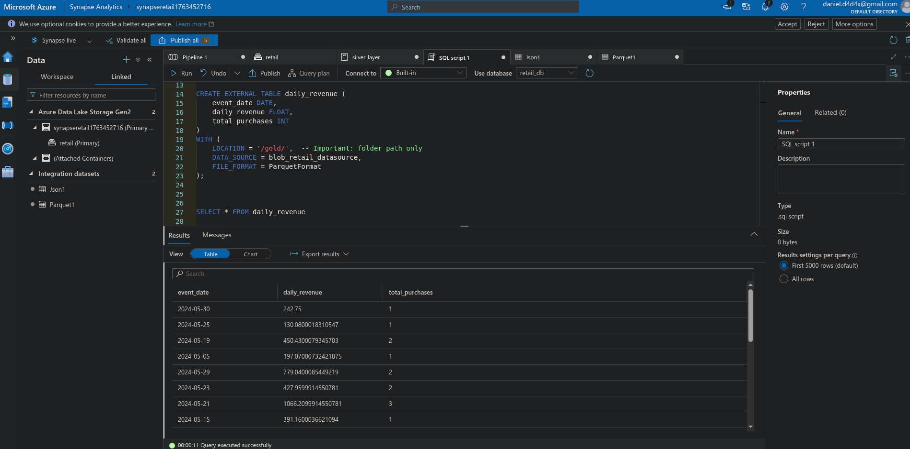

# Azure Retail Analytics Pipeline - Medallion Architecture

[](https://azure.microsoft.com/)
[](https://azure.microsoft.com/en-us/services/synapse-analytics/)
[](https://spark.apache.org/)
[](https://www.python.org/)

End-to-end data pipeline implementing **Medallion Architecture** (Bronze-Silver-Gold) on Azure. Processes retail transactions from REST API to analytics-ready data using Synapse Analytics, ADLS Gen2, and PySpark.

## Architecture


*Synapse Analytics workspace with Spark Pool and Serverless SQL Pool*

**Data Flow**: `GitHub API → Pipeline → Bronze → PySpark → Silver → Aggregation → Gold → SQL Analytics`

**Layers**:
- **Bronze (Raw)**: JSON ingestion from GitHub REST API
- **Silver (Cleaned)**: Filter purchases, remove nulls, standardize types
- **Gold (Aggregated)**: Daily revenue and transaction metrics

## Implementation


*Azure resources: ADLS Gen2 Storage, Synapse Workspace, Spark Pool*

### Bronze → Silver Transformation


*Raw transactions (1,000 records)*


*Cleaned purchase transactions (500 records)*

**PySpark transformations**: Filter by event type, drop nulls, convert dates, standardize payment methods, type casting

### Silver → Gold Aggregation

```python
df_daily_revenue = df_silver.groupBy("event_date").agg(
    sum("amount").alias("daily_revenue"),
    count("*").alias("total_purchases")
)
```

### SQL Analytics


*Serverless SQL Pool querying Gold layer with calculated metrics*

## Tech Stack

| Component | Technology |
|-----------|-----------|
| Orchestration | Azure Synapse Pipeline |
| Storage | Azure Data Lake Storage Gen2 |
| Processing | Apache Spark 3.3 (PySpark) |
| Analytics | Synapse Serverless SQL Pool |
| IaC | Azure CLI (Bash) |
| Format | Parquet |

## Quick Start

```bash
# Clone and setup
git clone https://github.com/Daniel-jcVv/az-RetailDataAnalyticsPipeline.git
cd az-RetailDataAnalyticsPipeline

# Login to Azure
az login

# Deploy infrastructure
chmod +x scripts/create-azure-resources.sh
./scripts/create-azure-resources.sh

# Verify deployment
./scripts/verify-resources.sh

# Execute notebooks in Synapse Studio
# 1. 01_bronze_to_silver.ipynb
# 2. 02_silver_to_gold.ipynb

# Query Gold layer
# Run synapse/sql-scripts/create_external_tables.sql in Serverless SQL Pool

# Cleanup
./scripts/delete-resources.sh
```

## Skills Demonstrated

- Medallion Architecture (Bronze-Silver-Gold)
- Azure Synapse Analytics configuration
- PySpark distributed processing
- ADLS Gen2 hierarchical namespace
- Synapse Pipeline orchestration
- Serverless SQL Pool analytics
- Infrastructure as Code (Azure CLI)
- Parquet columnar optimization

## Documentation

- [Azure CLI Commands Explained](docs/azure-cli-commands-explained.md)
- [Implementation Guide](IMPLEMENTATION_GUIDE.md)
- [Project Checklist](PROJECT_CHECKLIST.md)

---

## 👤 Author

**Daniel Garcia Belman**
Data Engineer | Big Data
- Email: danielgb331@outlook.com
- GitHub: [@Daniel-jcVv](https://github.com/Daniel-jcVv/Daniel-jcVv)
- LinkedIn: [My LinkenIn Profile](www.linkedin.com/in/daniel-garcía-belman-99a298aa)

---

## 📄 License

This project is licensed under the MIT License - see the [LICENSE](LICENSE) file for details.

---

## 🙏 Acknowledgments
>
>**Ora et labora, ahora**
>
>**Soli Deo gloria**